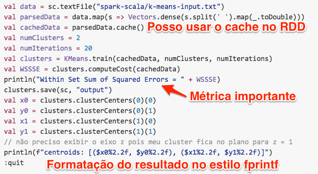
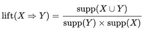
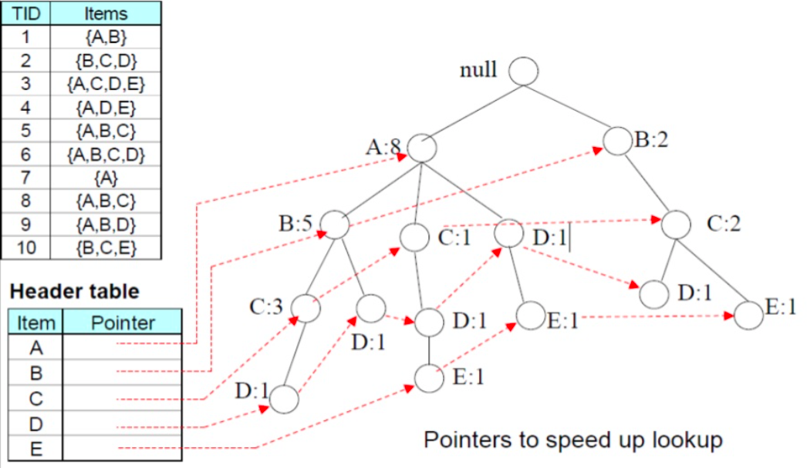

# Mining

## Data Mining com Scala e Spark usando MLlib

#### Agrupamento usando K-means

Vamos agora executar um Algorítimo de DataMining. Escolhi o processo conhecido
como **Agrupamento** pelo modelo **K-means** usando distância euclidiana.

Digite na `spark-shell`:

```scala
import org.apache.spark.mllib.clustering.{KMeans, KMeansModel}
import org.apache.spark.mllib.linalg.Vectors

val data = sc.textFile("spark-scala/k-means-input.txt")
val parsedData = data.map(s => Vectors.dense(s.split(' ').map(_.toDouble)))
val cachedData = parsedData.cache()
val numClusters = 2
val numIterations = 20
val clusters = KMeans.train(cachedData, numClusters, numIterations)
val WSSSE = clusters.computeCost(cachedData)
println("Within Set Sum of Squared Errors = " + WSSSE)
clusters.save(sc, "output")
val x0 = clusters.clusterCenters(0)(0)
val y0 = clusters.clusterCenters(0)(1)
val x1 = clusters.clusterCenters(1)(0)
val y1 = clusters.clusterCenters(1)(1)
// não preciso exibir o eixo z pois meu cluster fica no plano para z = 1 
println(f"centroids: [($x0%2.2f, $y0%2.2f), ($x1%2.2f, $y1%2.2f)]")
:quit
```

Segue abaixo uma imagem ilustrando o código mostrado acima.




#### Padrões Frequentes

Padrões Frequentes é um tipo de Mineração de dados para encontrar 
**Regras de Associação**. Por exemplo, considere o problema de encontrar 
padrões de comportamento de compra tais como: Quando um consumidor do sexo 
feminino compra uma bolsa a probabilidade de comprar também um sapato é 
alta (acima de 50%). Dependendo dos atributos contidos nas transações do 
Banco de Dados estes padrões podem ser refinados, por exemplo considerando 
faixa etária, bairro onde o consumidor reside, etc.

Padrões frequentes não estão restritos a compra de produtos. Por exemplo na
área médica podemos procurar padrões em exames de imagem (raios-X, Ultra-som,
Ressonância Magnética Nuclear, etc) pois se a imagem possui a característica 
A e B pode ocorrer de ter uma probabilidade alta de aparecer a característica
C. Considere por exemplo, monitoramento de automotivos. Um evento de falha no 
sistema de ignição (velas desgastadas ou sujas) é acompanhado de consumo 
alto de combustível. 

Existem dois outros tipos de Análise de Padrões que não consideraremos aqui:

* Padrões Sequenciais - Ocorre quando existe uma relação temporal entre os eventos 
que determinam a existência do padrão
* Padrões dentro de Séries Temporais - Ocorre quando padrões aparecem quando 
analisamos uma janela de tempo fixa,
como nos exemplos a seguir: Com janela de tempo por
estação podemos verificar que camisetas e bermudas tem o mesmo padrão de
venda no verão. Com janela de tempo de 24 horas podemos verificar que o
consumo de energia elétrica nas residências seguem um padrão nos dias de
semana e outro padrão nos fins de semana e feriados.

Estes dois tipos de padrões citados acima usam outras técnicas de mineração de dados.

Voltando as Regras de Associação, é preciso dizer que para identificar as
regras precisamos ter a lista de transações. Tal lista pode ser obtida de sistemas
transacionais ou de um Data Warehouse. 

As combinações possiveis entre itens cresce exponencialmente com o número de
itens distintos existentes. 
Número de combinações possíveis = `2^N - 1`, onde N é o número de itens 
distintos existentes no Database.

```
Para n = 2 -> t = 3, n = 3 -> t = 7, n = 4 -> t = 15, n = 5 -> t = 31, ... 
```

Veja exemplos abaixo:

```
1   [A]                1   [A]
2   [A B]              2   [A B]
3   [B]                3   [A B C]
                       4   [A B C D]
                       5   [A B D]
                       6   [A C]
1   [A]                7   [A C D]
2   [A B]              8   [A D]
3   [A B C]            9   [B]
4   [A C]              10  [B C]
5   [B]                11  [B C D]
6   [B C]              12  [B D]
7   [C]                13  [C]
                       14  [C D]
                       15  [D]
```

Existem vários algorítimos que cumprem o objetivo de descobrir as Regras de
Associação em transações. Para citar alguns, temos:

* Apriori
* FP-Growth
* Sampling Algorithm
* Partition Algorithm

O algorítimo **Apriori** é um dos mais conhecidos. Para entendê-lo vejamos 
algumas definições:

**Definição:** Um Itemset é um conjunto de itens que aparecem numa transação.

**Definição:** Um Itemset frequente é aquele que atende a uma dada condição
de probabilidade mínima de ocorrência considerando todo o Database de Transações.

**Definição:** Suporte absoluto ou support count de X, é a freqüência de um itemset X no database de transações.

**Definição:** Suporte Relativo é a fração de transações que contêm um itemset X, ou seja, é a probabilidade de uma transação conter X.

**Definição:** Confiança de X -> Y é a probabilidade conditional de que a transação que contenha um itemset X também contenha o itemset Y. A medida de Confiança envolve um par de Itemsets.


**Definição:** Lift



Se a regra tivesse um Lift de 1, isso implicaria que as probabilidades de ocorrência do antecedente e do conseqüente são independentes umas das outras. 
Quando dois eventos são independentes uns dos outros, nenhuma regra pode ser estabelecida envolvendo esses dois eventos.

Se o X é > 1, isso nos permite saber o grau em que essas duas ocorrências são dependentes umas das outras e torna essas regras potencialmente úteis para predizer o consequente em conjuntos de dados futuros.

A importância do Lift é que ele considera tanto a Confiança da regra como o Conjunto de dados globais.


O Algorítimo Apriori é baseado em dois princípios que ajudam a eliminar
elementos irrelevantes dos Itemsets melhorando a performance do Algorítimo ao
mesmo tempo que produz regras mais relevantes.

* Downward Clousure - Um subset de um Itemset grande também deve ser grande, do contrário ambos são desprezados.
* Antimonotonicity - Um superconjunto de um Itemset (conjunto de itens) pequeno, também é pequeno e deve ser desprezado.

Dado estas propriedades,

Veja abaixo os detalhes de execução do Algorítimo Apriori considerando o
seguinte conjunto de transações:

```java
String[] input6 = { 
  "A,B", "B,C,D", "A,C,D,E", "A,D,E", "A,B,C",
  "A,B,C,D", "A", "A,B,C", "A,B,D", "B,C,E" 
};
```

A, B, C, D e E são os itens encontrados nas transações. Poderiam ser: Sapato,
Bolsa, Camiseta, Bermuda, Cinto e etc. 

A execução do Algorítimo Apriori se dá da seguinte forma: 

Partindo das transações procuramos os **Itemsets candidatos**

```
Transações = [[A], [A, B], [B, C, E], [B, C, D], [A, D, E], [A, B, D], [A, B, C], [A, B, C], [A, C, D, E], [A, B, C, D]]
```

O número máximo de itens que ocorrem nas transações é 4

Devemos encontrar os Itemsets candidatos: **1-itemset, 2-itemset, 3-itemset, 4-itemset**

```java
// transactionsQty = 10
// minSupport = S
// threshold = T
```

O 1-itemset Candidato C1 é : 

```
[ [A: _ 8], [ B: _ 7], [ C: _ 6], [ D: _ 5], [ E: _ 3] ]
```

Os números que aparecem ao lado dos itens são o número de ocorrências 
correspondente destes nas transações. Estes números servem para calcular o
Suporte.

O "1-itemset" frequente considerando suporte 1% é `L1 = [A, B, C, D, E]`

Pela propriedade **Antimonotonicidade** temos: qualquer conjunto que inclua um 
dos elementos retirados do "1-itemset" acima por ficar abaixo do Suporte 
limite (threshold) pode ser ignorado. Por isso L1 terá apenas X elementos
dos Y existentes. Por exemplo se o Suporte for 20% temos 0.2 * 10 que é igual
a 2, portanto não retiramos ninguém, porém se o suporte for 50%, isso equivale
a retirar o elemento `E` do 1-itemset Candidato C1. Isso produzirá o
"1-itemset" frequente `L1 = [A, B, C, D]` o que afetará o processamento do
algorítimo, eliminando candidatos que contenham `E`, nas próximas iteração 
para `n-Itemset`, dado que `n > 1`.

No exemplo atual consideraremos Suporte de 30% por uma questão didática.

O "1-itemset" frequente considerando suporte de 30% é `L1 = [A, B, C, D, E]`

O 2-itemset Candidato C2 contém 10 elementos e é : 

```
[ [[A B]: _ 5], [ [A C]: _ 4], [ [A D]: _ 4], [ [A E]: _ 2], [ [B C]: _ 5], [ [B D]: _ 3], [ [B E]: _ 1], [ [C D]: _ 3], [ [C E]: _ 2], [ [D E]: _ 2] ]
```

O "2-itemset" frequente considerando suporte de 30% é **L2** que fica assim:

```
[ [[A B]: _ 5], [ [A C]: _ 4], [ [A D]: _ 4], [ [B C]: _ 5], [ [B D]: _ 3], [ [C D]: _ 3]
```

O 3-itemset Candidato C3 contém 8 elementos e é : 

```
[ [[A B C]: _ 3], [ [A B D]: _ 2], [ [A C D]: _ 2], [ [A C E]: _ 1], [ [A D E]: _ 2], [ [B C D]: _ 2], [ [B C E]: _ 1], [ [C D E]: _ 1] ]
```

O "3-itemset" frequente considerando suporte de 30% é **L3* que fica assim:

```
[ [[A B C]: _ 3] ]
```

Observe que o "2-itemset" frequente L2 contém os elementos `[A B], [A C] e [B C]`
portanto não podemos aplicar a regra **Downward Clousure** para reduzir os
elementos em L3. Caso qualquer um dos três "2-itemset" acima fosse eliminado
este "3-itemset" frequente acima também seria eliminado.

Continuando com a varredura no Database de Transações.

O 4-itemset Candidato C4 contém 2 elementos e é : 

```
[ [[A B C D]: _ 1], [ [A C D E]: _ 1] ]
```

Ambos tem Suporte menor que 30% portanto o "4-itemset" frequente considerando
suporte de 30% é **L4* que é vazio. 

Como o número máximo de elementos nas transações é 4 o processo de
construção dos "k-itemsets" Frequentes é interrompido.

Observe que no pior caso o número de combinações possíveis de itemsets é
`2^N - 1`, onde N é o número de itens distintos existentes no Database 
(5 neste nosso exemplo). Isso nos leva a uma complexidade de algorítimo para
o Apriori de ordem Exponencial. Downward Clousure e Antimonotonicity diminuem
consideravelmente o número de Itemset porém o componente exponencial é causa
problemas para processamento de Bancos de Dados com muitos itens distintos, como
por exemplo, numa rede de varejo com milhares de itens diferentes.

Desta forma diversos pesquisadores trabalharam em melhorias neste tipo de
algorítimo. As mudanças são em como gerar os Itemsets de forma mais eficiente
e como calcular o suporte para o Itemset. Algumas propostas usam estruturas
de dados diferentes (bitmap, hash tree) para manter os dados relativos aos
Itemsets. 

O Algorítimo **FP-Growth** é uma dessas otimizações em relação ao Apriori.
Ele usa uma árvore (tree) e uma _header table_  para listas encadeadas como
mostrado na figura abaixo:



Isso coloca um componente log(N) na complexidade do algorítimo que melhora muito
pois usa o princípio "Dividir para Conquistar" típicos de pesquisa em árvores.

Uma vantagem adicional do FP-Growth é que ele pode ser Paralelizado com 
escalabilidade Linear e portanto pode ser executado em Cluster de Computadores
ou em Cloud Computing e passa a ser capaz de tratar virtualmente qualquer
volume de dados. A API MLib do **Apache Spark** implementa uma versão paralelizada
do FP-Growth.

**Usando o Spark para encontrar Padrões Frequentes**

Vamos agora executar um Algorítimo de Mineração de Dados para descoberta de 
Regras de Associação. O algorítimo de Padrões Frequentes **FP-Growth**
é mais eficiente que o **Apriori** para Datasets maiores, além disso é o Spark 
não suporta o algorítimo Apriori. Uma informação bastante importante sobre a
implementação do Spark é que ela é baseada num _paper_ que propõe solução para
paralelizar o algorítimo FP-Growth permitindo que ele rode em Cluster com
escalabilidade linear. Isso é um grande diferencial quando se trata de Minerar
em quantidades gigantescas de dados. O paper a que me refiro é o 
[PFP: parallel fp-growth for query recommendation](http://dl.acm.org/citation.cfm?doid=1454008.1454027)
do Haoyuan Li et al(2008).

Considere o seguinte exemplo: **Market basket analysis**

> Market basket analysis is about identifying items in the supermarket which customers are more likely to buy some itens together. e.g., Customers who  bought pampers also bought beer [ only men at dawn :-) ] 

Digite na `spark-shell` no seu terminal, depois entre com o código Scala:

```scala
import org.apache.spark.mllib.fpm.FPGrowth

// Itens interessantes começam com indice 1 mas Scala e Java começam com 0
val itens = Array("dummy", egg", "beer", "pampers", "carrot", "milk", "perfume", "tissues")

// Transactions
val t1 = Array(itens(1), itens(2), itens(3) , itens(5)) // João
val t2 = Array(itens(4), itens(5), itens(3) , itens(2)) // Maria
val t3 = Array(itens(6), itens(7), itens(4)) // Zuleika
val t4 = Array(itens(6), itens(3), itens(2)) // Pedro

val transactions = Array(t1, t2, t3, t4)

// Make transaction collection parallel with Spark
val transactionsRDD = sc.parallelize(transactions).cache()

// Set configurations for FP-Growth
// Suporte de 50%
// Usar 10 maquinas/core no Cluster

val fpg = new FPGrowth().setMinSupport(0.5).setNumPartitions(10)

// Generate model (FPGrowthModel)
val model = fpg.run(transactionsRDD);

// Display frequently co-occuring items 
model.freqItemsets.collect().foreach { 
  itemset => println(itemset.items.mkString("[", ",", "]") + ", " + itemset.freq)
}
```

Outro exemplo, porém lendo de arquivo texto.

Digite o código **Scala** abaixo:

```scala
import org.apache.spark.mllib.fpm.FPGrowth

val data = sc.textFile("fpgrowth.txt")

// Transformando de RDD[String] para RDD[Array[String]]
val transactions = data.map(s => s.trim.split(' '))

// Suporte de 20%
val fpg = new FPGrowth().setMinSupport(0.2).setNumPartitions(10)
val model = fpg.run(transactions)

model.freqItemsets.collect().foreach { 
  itemset => println(itemset.items.mkString("[", ",", "]") + ", " + itemset.freq)
}

val minConfidence = 0.5
model.generateAssociationRules(minConfidence).collect().foreach { rule =>
  println(rule.antecedent.mkString("[", ",", "]") + " => " + rule.consequent .mkString("[", ",", "]") + ", " + rule.confidence)
}

// Usando a classe AssociationRules limitada a UM único consequente
import org.apache.spark.mllib.fpm.AssociationRules
import org.apache.spark.mllib.fpm.FPGrowth.FreqItemset

val freqItemsets = sc.parallelize(Seq(
  new FreqItemset(Array("1"), 15L),
  new FreqItemset(Array("2"), 35L),
  new FreqItemset(Array("1", "2"), 12L)
)).cache()

val ar = new AssociationRules().setMinConfidence(0.3)
val results = ar.run(freqItemsets)

results.collect().foreach { rule =>
  println("[" + rule.antecedent.mkString(",")
    + "=>"
    + rule.consequent.mkString(",") + "]," + rule.confidence)
}

// Minerando Padrões Sequenciais Frequentes
import org.apache.spark.mllib.fpm.PrefixSpan

val sequences = sc.parallelize(Seq(
  Array(Array(1, 2), Array(3)),
  Array(Array(1), Array(3, 2), Array(1, 2)),
  Array(Array(1, 2), Array(5)),
  Array(Array(6))
), 2).cache()

val prefixSpan = new PrefixSpan().setMinSupport(0.5).setMaxPatternLength(5)
val model = prefixSpan.run(sequences)
model.freqSequences.collect().foreach { 
  freqSequence => println(freqSequence.sequence.map(_.mkString("[", ", ", "]")).mkString("[", ", ", "]") + ", " + freqSequence.freq)
}
```

## Formulas LaTeX


```tex
conf(X \Rightarrow Y) = \frac{ supp( X \cup Y )}{supp( X )} 
```


